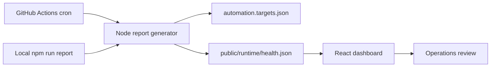

# Swift Go Delivery Service

Dispatch Pulse is a cron-backed delivery operations console. It pings a small set of endpoints, measures response latency, records a daily health snapshot, and renders the latest run in the browser.

## What it does

- Runs a scheduled health check against configurable delivery-service dependencies.
- Writes the latest run to `public/runtime/health.json` so the dashboard always has data to display.
- Maintains `public/runtime/history.json` so the app can plot recent success-rate history.
- Evaluates alert thresholds for summary and per-route metrics.
- Refreshes the same snapshot locally with `npm run report` and in GitHub Actions on a daily cron.

## Architecture



## Project layout

- `src/` contains the React dashboard.
- `scripts/generate-health-report.mjs` performs the scheduled checks and writes the runtime snapshot.
- `automation.targets.json` stores the monitored endpoints, route groups, and alert rules.
- `.github/workflows/dispatch-pulse.yml` runs the same report on a daily cron and commits the generated snapshot.

## Getting started

```bash
npm install
npm run dev
```

## Refresh the snapshot locally

```bash
npm run report
```

The command checks each configured endpoint, writes the result to `public/runtime/health.json`, and prints the report to stdout.

It also updates `public/runtime/history.json` with the latest run so the dashboard can show a running chart of recent performance.

## Configuration

Edit `automation.targets.json` to change the monitored endpoints, expected status codes, or project metadata.

## Deployment notes

- Use Node 20 or newer for the scheduled report script.
- The GitHub Action requires repository write access so it can commit the generated snapshot.
- If a check becomes optional, mark it non-critical in the config and keep the dashboard focused on the endpoints that matter.

## Scripts

- `npm run dev` starts the Vite app.
- `npm run build` creates the production bundle.
- `npm run lint` runs ESLint.
- `npm run report` refreshes the generated health snapshot.
